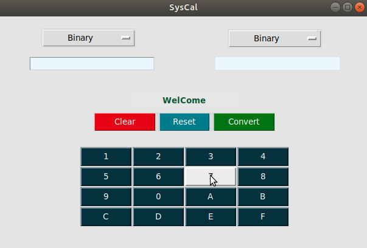

# NumSysConverter
 
This Project is based on the Number System Conversion where you can convert Numbers among Binary, Octal, Decimal and Hexadecimal. 
<b>How to run this project:</b>
 
from the github link after downloading the all file just run the 'syscal' runnable file(in directory dist). 
this project is suitable for Python3 so if you want to run it in terminal using the source code only then 
Run the cmd "python3 syscal.py" 
Play the video Syscal.mp4 in the repository for more clearity.  
Thank you.
